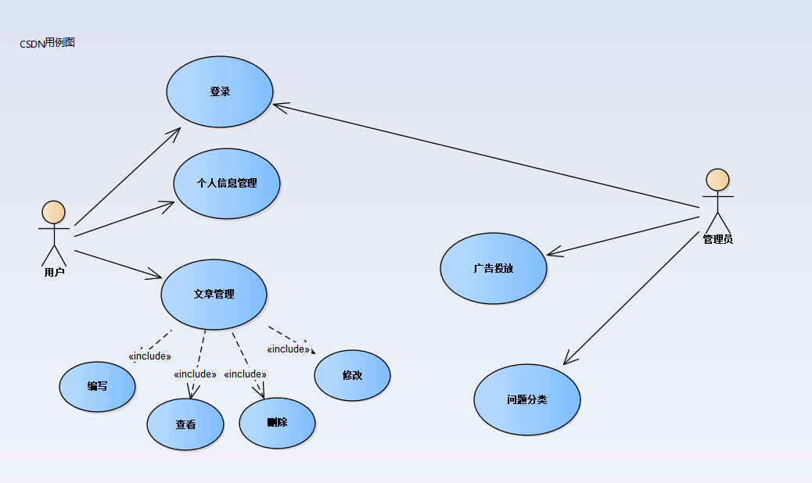
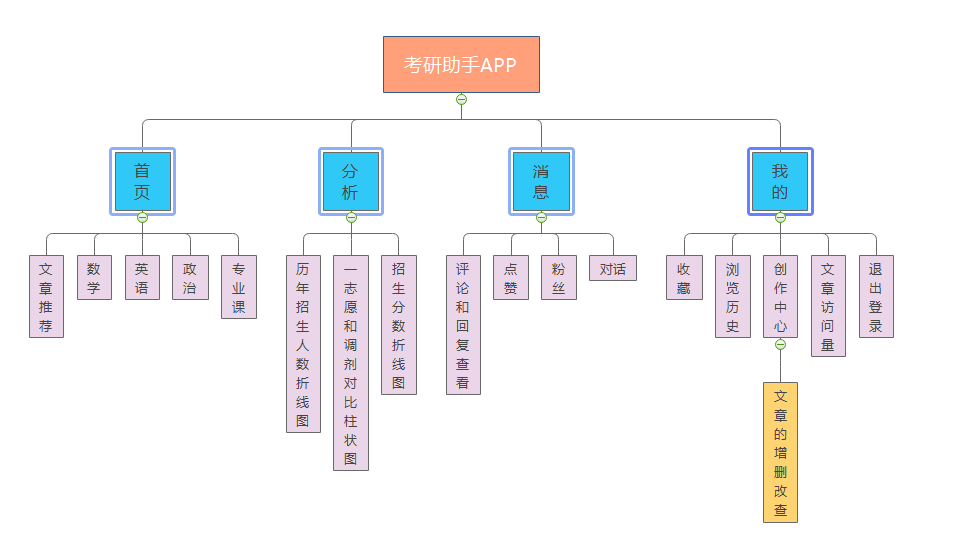
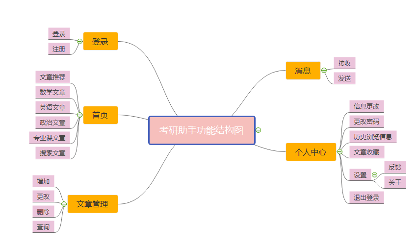
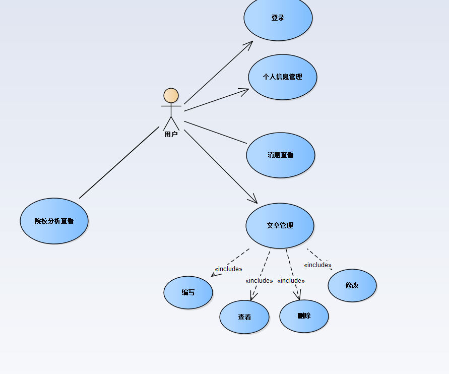
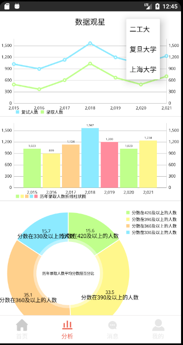
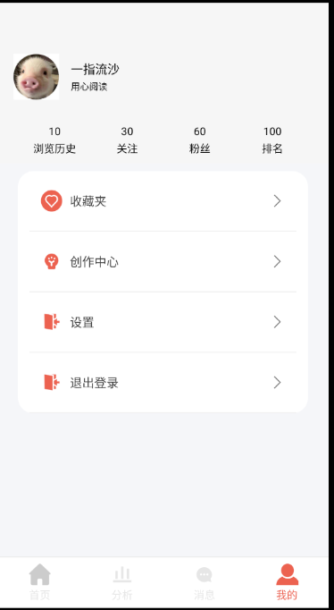
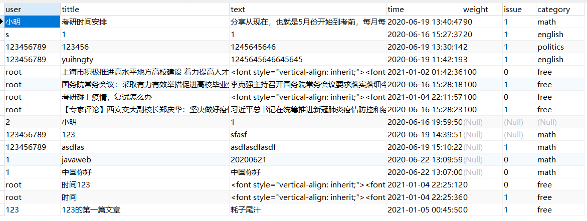
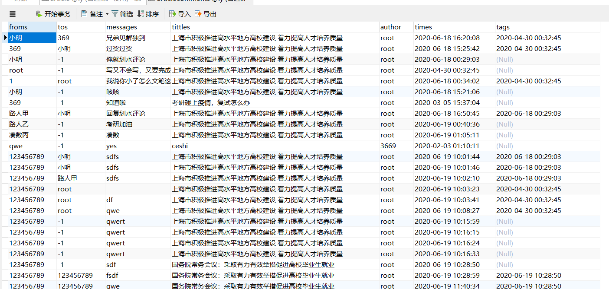
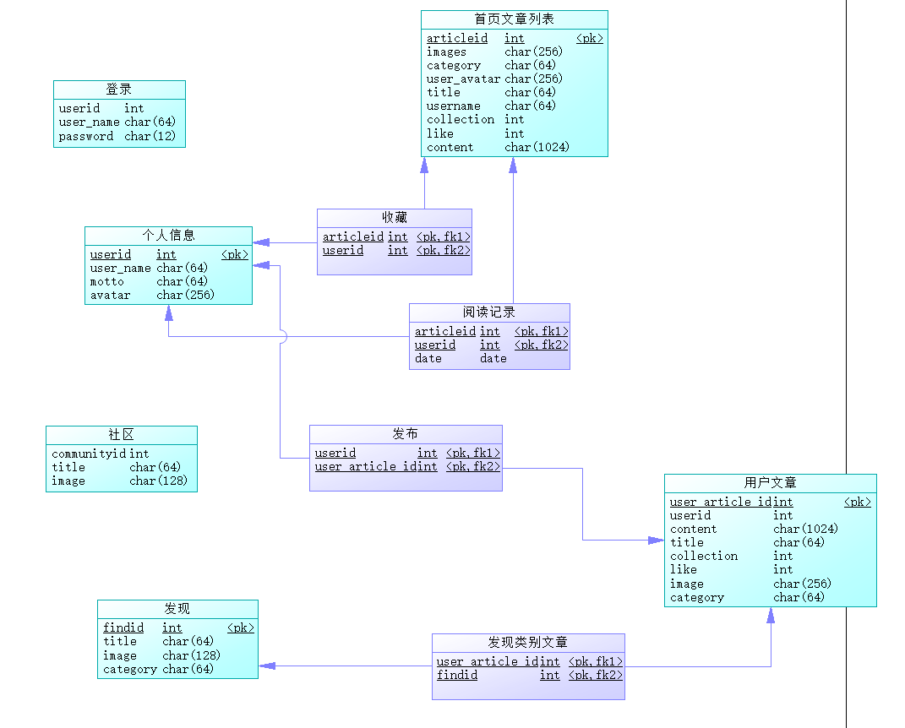

# kaoyanAndroidApp
关于考研的经验文章分享、考研院校录取数据分析
目录

1、概述 --------------------------------------------------------------- 2

>   1.1研究背景 ------------------------------------------------- 2

>   1.2研究方法 ------------------------------------------------- 2

>   1.3市场调研情况---------------------------------------------------- 2

2、需求分析 --------------------------------------------------------------- 5

2.1概述 ---------------------------------------------------------------- 5

2.2产品结构 ----------------------------------------------------------- 6

>   2.2.1信息结构 ----------------------------------------------- 6

>   2.2.2功能结构 ----------------------------------------------- 6

2.3需求说明 --------------------------------------------------------- 7

2.4界面原型 --------------------------------------------------------- 7

>   2.4.1用例图 ------------------------------------------- 7

>   2.4.2主页 ------------------------------------------- 8

>   2.4.3院校分析 ------------------------------------------- 9

>   2.4.4消息 ------------------------------------------- 10

>   2.4.5个人中心 -------------------------------------------- 11

5、数据库设计 ----------------------------------------------------------------
12

>   数据库表说明---------------------------------------------------- 12

>   数据库ER图------------------------------------------------------ 12

6、项目地址-------------------------------------------------------------------
12

经验文章及信息分享类APP调研报告

摘要：本调研报告通过对经验文章及信息分享类的APP的产品的使用和功能点进行调研和对比，分析在目前出现的经验文章及信息分享类的APP的产品中对相似产品的共性特点，获取相关用户的使用反馈和群体画像，记录APP各自的独特之处，体验APP进行人机交互的方式等常用调研方法。为今后以此为主题的手机应用程序其他开发者提供参考信息，也为此次产品开发中所遇到的需求问题提供理论参考依据。

>   关键词:经验文章及信息分享；APP；调研报告；

一、研究背景：

互联网的快速发展使获取信息的途径更加便捷，也变得越来越多样化。对获取信息过程中的获取效率的重视程度也日益剧增。各种相关领域的经验借鉴及心得分享也更加追求及时、便捷。目前有很多类似特性的APP也如雨后春笋般的出现，虽然大多数类似特性的APP都有极强的共性特点，但是也有着其特有独到之处。本次调查报告着重于文章及信息分享类的手机应用程序进行调查研究。

二、研究方法：

（1）、资料分析、归纳法

通过搜索相关类似APP的信息，体验相关APP的功能，包括相关的实现案例、论文研究，搜集相应的资讯以及APP的定位前景开发介绍，归纳分析了相似产品的共性特点，相应用户的使用反馈和群体画像，APP各自的独特之处，进行人机交互的方式这几个要素，对这些类型的APP进行深入研究。

（2）、案例分析法

通过具体的使用类似的APP，从中提取相应具有共性或独特功能的设计模块。

三、市场调研情况：

通过长时间使用相同类型的APP并及时记录使用时候相应的功能体验，深入对比每一款APP的长短处，通过提取各个APP的优点，摒弃其不足之处，从各自的用户群体画像、产品出发的立意角度、相同功能点、特殊功能点这几个方面进行较为全面的分析。立足于创意、创新的角度。找出具有代表性的APP，目前发现较具有一定代表性的APP有：CSDN、知乎等。

（1）产品介绍、定位及用户群体画像

①CSDN，CSDN的全称是Chinese Software Developer
Network，是全球知名中文IT技术交流平台,创建于1999年,包含原创博客、精品问答、职业培训、技术论坛、资源下载等产品服务,提供原创、优质、完整内容的专业IT技术开发社区.

CSDN的服务对象主要为IT人才提供中文版的社区和服务平台，给IT从业人员提供在职业发展中的学习、社交等服务，致力于借助网络社区的力量解决在开发过程中遇到的问题并给出优质的解决方法。

②知乎，中文互联网高质量的问答社区和创作者聚集的原创内容平台，于 2011 年 1
月正式上线，以「让人们更好地分享知识、经验和见解，找到自己的解答」为品牌使命。提供一个优质问答的平台。

知乎的服务对象主要是青年群体，大学生是其中的重要组成部分。用户的职业主要以互联网行业为主，囊括了计算机、金融、高等教育等行业。知乎的用户也具有较好的阅读习惯、大约是知识的中产阶级、兴趣多元化、喜欢新事物、爱玩爱分享、是新时代的人群的典型代表。知乎用户的数据信息由22个模块组成，涵盖了用户个人资料、个人成就、知识分享信息以及基本动态等。

（2）产品创意

①CSDN
在IT人才的推动和交流下，为IT技术学习和从业人员带来了极大的便利，提供了良好的与学习相关的干货资料。并给出了IT问题的出现原因和解决办法。让用户在出现问题的时候通过搜索关键字就可以及时有效的解决问题。还将技术分类形成具体的专栏，给出详细的技术学习和发展路线。

②知乎
知乎主要以问答的形式对社会上出现的问题进行探讨。文章内容具有一定深度性，在热点问题的评论区也是十分热闹。围绕一个观点可以延伸出其他不同的论点。具有极大的阅读性。

（3）功能共性点

用户搜索遇到的常见的问题，就会给出相应的观点的文章或者解决办法，用户也可以自定义编写文章并将其发布到相应的栏目类别里面，其他用户可以搜索、查看、评论这篇文章。

界面都由推送文章的首页、提供购买服务和特权的会员界面、心情吐槽的社区模块、接收读者或其他用户消息的信息页面以及个人信息管理的我的页面构成。

展示页面都是可以点击进入查看文章的内容，并作出评价，在文章的最底部会推送相似问题的文章或者做出广告增加网站收入。文章均提供评论、点赞、收藏的功能。

会员页面会给出购买会员所提供的价格，会员所享受的优质资讯服务和更好的使用体验。以及不同于非会员的内容。

社区模块展示了推荐、附近、话题功能。展示出心情交流帖亦或者是交友贴等等，增加了APP的线下互动的趣味性以及丰富多彩的另一面，给APP带来了相应的活力和不一样的色彩。

消息交流方面知乎和CSDN都可以进行实时的交流，并且都有官方发出消息给用户。也可以对其他用户进行关注等，也实现了对用户自己的消息、评论的管理

个人信息页面里面则都是对自己的浏览历史、收藏的文章、个人主页等栏目的展示、查看和管理。也有相应的反馈和建议。

用户也都可以通过开通会员的权限来阅读平台上面的书籍。对部分专刊的知识内容需要付费，同时也可以对自己所喜爱的用户进行打赏。

这些平台官方的功能主要是审核回答是否违反了规范，并不干预作者对文章内容的自由撰写。撰写文章的时候两个平台都能实时的自动保存文章的内容，极大的减少了因为大意而造成文章丢失的意外事件的发生。

值得一提的是，在上述页面中均在不同程度上夹杂着广告页面，但广告出现的位置虽然比较显眼，但是广告出现的时候没有那么排斥的感觉。

(4) 特殊功能点

①CSDN
在社区问答的基础上拓展了学习专栏，给出优质的技术发展路线，以及详细的分化各个技术领域的技术点。可以采用makdown格式来编写文章，对于代码的展示和阅读有良好的体验。统计博文数据、下载数据、阅读数据、收益数据、粉丝数据等并绘制了相应的数据展示曲线。更直观、全面的向用户展示其文章及其相应的活动和其他用户的反响的阅读情况。CSDN的首页部分细分为JAVA、Python、前端等，凸显了CSDN的功能朝着专业化、精准化方向发展的理念，更贴近职业生活。由此可见，通过这样的专栏分类，使得用户也能更加精准快速的学习自己想要点亮的专业技能树。

②知乎
则主要以出现的热点问题或想法为导向，文章的主题围绕着问题来进行作答。文章讨论的主题是就问题来展开论述，并阐述自己的观点。当然也有专栏的形式是用户自己自拟标题进行创作。知乎首页上方对部分内容细分为热榜、校园、脑洞、考研等这也更加体现了知乎的主要群体是大学生，并且显得APP的适宜群体更为年轻化。APP的内容分类的具体细节更加贴近生活中的内容。

四、调研总结：

本文通过对具有经验文章及信息分享的手机应用程序进行调查研究，深入分析各个手机应用程序的特点，总结出应用程序所应该拥有的基本功能和可能的拓展方向得出如下结论：

（1）界面设计：经验文章及信息分享的手机应用程序至少需要一个主要的首页来展示相关内容，方便用户进行阅览。对话界面来实现用户和用户之间的沟通交流。个人资料界面对自己的信息进行编辑。反馈的功能与应用程序的设计者一起改善应用程序的使用体验。最好再有一个社区功能可以抒发用户的心情以此来增加应用程序的趣味性。

（2）程序功能：这些应用程序可以通过搜索来获取内容相似的文章。评论功能来和文章的编写者或其他用户来对文章的内容进行讨论交流。文章编写者可以通过便捷的文本编辑器来编写文章的内容并及时的自动保存，避免文章丢失。拥有文章内容管理模块和收藏文章的功能。

（3）对用户需求的具体内容进行分析归类，分类更贴近用户真实的使用情况。也更易于用户快速找到相应的类别的模块。

（4）对特定的数据类型进行图画或图标的形式分析，使用户对数据的感受更为直观，突出数据的具体特点。

（5）宣传的广告不能过于突兀影响用户的使用体验。

具体解释见功能共性点和特殊功能点

**需求分析**

**一、概述**

产品介绍

| 产品名称   | 考研助手                                                     |
| ---------- | ------------------------------------------------------------ |
| 产品slogan | 助力考研每一刻                                               |
| 产品定位   | 一款解决考研中遇见的时间规划、科目安排及进度、院校分析的应用程序 |
| 产品描述   | 首页、发布文章、院校分析、消息收发管理、个人中心             |
| 关键词     | 考研、文章分享、院校专业分析                                 |
| 目标人群   | 有考研需求的人员                                             |
| 使用场景   | 需要了解相关的考研知识和院校择校信息                         |

**二、产品结构**

1.信息结构

2.功能结构

三、需求说明

-   不同类别的文章的查看

-   搜索文章

-   文章的发布、添加、修改、查看、删除

-   消息的接收和发送

-   个人信息的管理

**四、界面原型**

1.用例图

2.主页

说明:首页由搜索框、发布信息的加号、文章类别构成底部是存在的导航栏tabs，点击不同的类别会加载不同的fragment

3.院校分析

院校分析准备用MPAndroidChart库来实现相应的信息可视化，

第一个折线图展现院校历年招生专业的分数最低分和最高分，第二个柱状图展示院校历年的招生人数，第三个饼状图展现专业录取分数的百分比(10分为一个档)

4.消息

与其他读者的交流对话，点击考研查看具体收发的信息

5、个人中心

个人中心有用户头像、浏览历史、用户关注的人、关注用户的人、用户发布文章的排名、用户收藏的文章、用户创作的文章、设置、退出登录组成

五、数据库设计

数据库设计说明

| article数据表展示 说明：user字段代表这篇文章是谁写的，tittle是文章的标题、text是文章内容，time是文章最后一次修改时间，weight是文章的权重，根据文章的点击次数来增加权重，issue标识文章的状态，1是发布文章，0是文章暂存（未发布），category是文章类别，标识文章所属的是哪一个范畴的 |
| ------------------------------------------------------------ |
|               |
| articlecomments文章评论数据表说明 froms是标识评论是谁发布的，tos代表评论是回复谁的，message是评论内容，tittles代表评论所属的文章标题，author是文章得作者，times是评论发表的时间，tags是这个评论所回复评论的时间（作为uuid）。为null的是回复主贴的评论 |
|               |

数据库ER图

项目地址

https://github.com/674e-8fd0/kaoyanAndroidApp

参考文献：

(1)汪露露. 文艺类App设计过程研究[D].苏州大学,2016.

(2)百度百科关于CSDN和知乎的介绍

(3)知乎产品分析报告https://www.jianshu.com/p/f90894c55d87

附件：功能点用例图